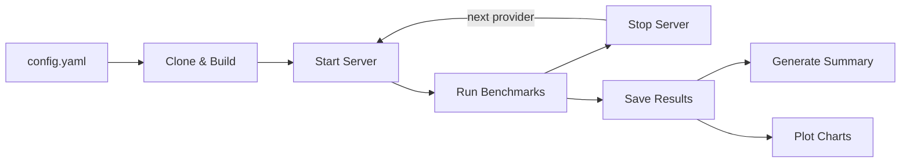
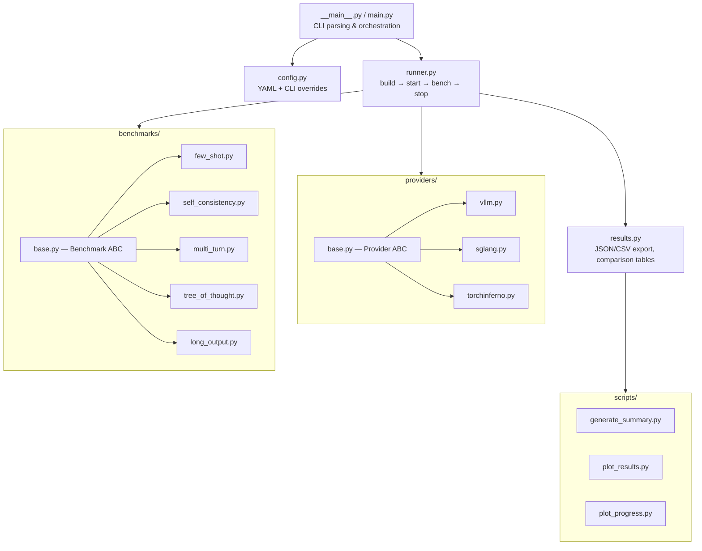

# inference-bench

[](https://www.python.org/downloads/)

Benchmark and compare LLM inference engines side-by-side on identical hardware
with identical prompts.

inference-bench builds each engine from source, launches an
[OpenAI-compatible](https://platform.openai.com/docs/api-reference/chat) server,
and runs a suite of benchmarks that stress different parts of the serving stack
(prefill, decode, KV cache, scheduling). Every request is streamed and timed
token-by-token to produce per-request TTFT, TPOT, E2E latency, and throughput
numbers.



---

## Table of contents

- [Providers](#providers)
- [Benchmarks](#benchmarks)
- [Metrics](#metrics)
- [Quick start](#quick-start)
- [CLI reference](#cli-reference)
- [Configuration](#configuration)
- [Results](#results)
- [Architecture](#architecture)
- [Extending](#extending)

---

## Providers

| Provider | Repository | Description |
|----------|-----------|-------------|
| **vLLM** | [vllm-project/vllm](https://github.com/vllm-project/vllm) | High-throughput LLM serving with [PagedAttention](https://arxiv.org/abs/2309.06180) |
| **SGLang** | [sgl-project/sglang](https://github.com/sgl-project/sglang) | Fast serving framework with [RadixAttention](https://arxiv.org/abs/2312.07104) |
| **TorchInferno** | [bobrenjc93/TorchInferno](https://github.com/bobrenjc93/TorchInferno) | PyTorch-native inference engine |

Each provider implements the [`Provider`](inference_bench/providers/base.py) ABC:
clone → build → start OpenAI-compatible server → health-check → benchmark → stop.

---

## Benchmarks

All benchmarks target ~10,000 requests to produce statistically meaningful results.

| Benchmark | Requests | Concurrency | What it tests | Source |
|-----------|----------|-------------|---------------|--------|
| **few_shot** | 10,000 | 64 workers | 5-shot math prompts — prefill speed under load | [`few_shot.py`](inference_bench/benchmarks/few_shot.py) |
| **self_consistency** | 10,000 | 128 workers | Identical prompts at `temp=0.7` — batch throughput & prefix caching | [`self_consistency.py`](inference_bench/benchmarks/self_consistency.py) |
| **multi_turn** | 10,000 | 64 workers | 1,250 eight-turn conversations — KV cache management | [`multi_turn.py`](inference_bench/benchmarks/multi_turn.py) |
| **tree_of_thought** | ~10,000 | 16 trees | 323 tree searches (4-wide × 3-deep) — bursty scheduling | [`tree_of_thought.py`](inference_bench/benchmarks/tree_of_thought.py) |
| **long_output** | 10,000 | 64 workers | `1 × <huge_number>` multiply — decode throughput | [`long_output.py`](inference_bench/benchmarks/long_output.py) |

Each benchmark subclasses [`Benchmark`](inference_bench/benchmarks/base.py) and
uses the [OpenAI Python SDK](https://github.com/openai/openai-python) streaming
chat completions API.

---

## Metrics

Every request is streamed and timed to capture:

| Metric | Description |
|--------|-------------|
| **TTFT** | Time to First Token — latency from request send to first token received (ms) |
| **TPOT** | Time per Output Token — average inter-token latency during decode (ms) |
| **E2E** | End-to-end latency — total wall-clock time per request (ms) |
| **Throughput** | Output tokens per second per request (tok/s) |
| **Correctness** | Whether the model's answer matches the expected result |

These are aggregated across all requests in each benchmark as **median** and
**p99** values. A
[scorecard](scripts/generate_summary.py) counts metric wins per provider per
benchmark to determine the overall winner.

---

## Quick start

### Prerequisites

- [**Python**](https://www.python.org/downloads/) ≥ 3.10
- **NVIDIA GPUs** (tested on 8×H100)
- [**protoc**](https://github.com/protocolbuffers/protobuf/releases) — required by SGLang's Rust gRPC build
- [**Rust**](https://rustup.rs/) — required by SGLang / [outlines_core](https://github.com/dottxt-ai/outlines-core)
- [**HuggingFace token**](https://huggingface.co/settings/tokens) — for gated model access (e.g. [Llama 3.1 70B Instruct](https://huggingface.co/meta-llama/Meta-Llama-3.1-70B-Instruct))

### Install

```bash
pip install -e .
```

> [!NOTE]
> [matplotlib](https://matplotlib.org/) is needed for plot generation but is not
> a core dependency. Install separately: `pip install matplotlib`

### Run

```bash
python -m inference_bench \
  --port 8001 \
  --hardware 8xH100
```

This clones and builds all providers from source, then runs every benchmark.
Expect several hours for a full run (builds ~15 min each, then 5 benchmarks ×
10k requests per provider).

The package also installs an `inference-bench` console entry point, so after
`pip install -e .` you can run `inference-bench --help` directly.

### Evaluation v3: strict standard serving

Evaluation v3 reruns the v2 workloads with one TP8 server per provider. It adds
pinned model/source provenance, GPU coverage and isolation, full response
retention, authoritative client-side token counts, and result eligibility gates.

```bash
python -m inference_bench \
  --config config_v3.yaml
```

Results go to `results/v2/`. Evaluation v3 is standard serving by definition;
deployment topology is derived from the evaluation version and is not a config
toggle. Every request explicitly sends `top_p=1.0`; scored results record that
value per request and become non-comparable if it is missing or different.

### Evaluation v4: disaggregated prefill/decode

Evaluation v4 uses a 4-GPU prefill role and a separate 4-GPU decode role for
every provider. `evaluation_version: 4` selects the topology automatically.

```bash
python -m inference_bench \
  --config config_v4.yaml
```

The run uses TorchInferno's native prefill/decode mode, vLLM's upstream KV
connector, and SGLang's Mooncake backend and model gateway. Results go to
`results/v3/`; the output records both role TP sizes and runtime KV-handoff
evidence. See [`docs/V4_DISAGGREGATED_EVAL.md`](docs/V4_DISAGGREGATED_EVAL.md).

Scored v3 and v4 runs require an unused build directory and a complete local
copy of the pinned model revision. They reject `--skip-build`, local provider
checkouts, and arbitrary provider server-argument environment variables.

### Run remotely (via gpu-dev)

```bash
bash run_benchmark.sh
```

Reserves 8×H100 for 8 hours via `gpu-dev submit`, runs
[`_remote_benchmark.sh`](_remote_benchmark.sh) on the remote node (installs all
dependencies, creates a venv, runs the full benchmark), then syncs results back,
commits, and pushes. See [`run_benchmark.sh`](run_benchmark.sh) for details.

### Skip builds (reuse existing)

```bash
python -m inference_bench \
  --providers vllm sglang torchinferno \
  --skip-build \
  --build-times "vllm:807.8,sglang:87.5,torchinferno:38.3" \
  --port 8001 \
  --hardware 8xH100
```

### GPU memory preflight

Before starting vLLM or SGLang, inference-bench waits until the visible GPUs have
enough free memory for the provider's startup allocation. This prevents a
provider from failing late because a previous server or unrelated process still
owns GPU memory.

After startup, inference-bench also waits for unrelated compute processes to
leave the selected GPUs before each benchmark and marks a benchmark failed if a
new unrelated GPU process appears while requests are running.

Useful environment variables:

```bash
INFERENCE_BENCH_GPU_MEMORY_WAIT=0              # disable the preflight
INFERENCE_BENCH_GPU_MEMORY_WAIT_TIMEOUT_S=900  # maximum wait
INFERENCE_BENCH_GPU_MEMORY_WAIT_POLL_S=10      # poll interval
INFERENCE_BENCH_GPU_MEMORY_FREE_FRACTION=0.90  # provider fallback threshold
INFERENCE_BENCH_GPU_ISOLATION_CHECK=0          # disable checks (rejected by scored disagg)
INFERENCE_BENCH_GPU_COVERAGE_CHECK=0           # disable coverage (rejected by scored disagg)
INFERENCE_BENCH_GPU_ISOLATION_TIMEOUT_S=900    # maximum isolation wait
INFERENCE_BENCH_GPU_ISOLATION_POLL_S=2         # pre-benchmark poll interval
INFERENCE_BENCH_GPU_ISOLATION_CLEAN_WAIT_S=5   # required clean window
INFERENCE_BENCH_VLLM_MIN_GPU_FREE_FRACTION=0.92
INFERENCE_BENCH_VLLM_GPU_MEMORY_UTILIZATION=0.90
INFERENCE_BENCH_VLLM_PREFILL_GPU_MEMORY_UTILIZATION=0.90
INFERENCE_BENCH_VLLM_DECODE_GPU_MEMORY_UTILIZATION=0.70
INFERENCE_BENCH_VLLM_FLASHINFER_WORKSPACE_BUFFER_SIZE=413138944  # default FlashInfer workspace
INFERENCE_BENCH_VLLM_SERVER_ARGS="--disable-custom-all-reduce"    # append vLLM server args
INFERENCE_BENCH_SGLANG_MIN_GPU_FREE_FRACTION=0.85
INFERENCE_BENCH_SGLANG_MEM_FRACTION_STATIC=0.85
INFERENCE_BENCH_SGLANG_SERVER_ARGS="--max-running-requests 256"
INFERENCE_BENCH_SGLANG_DISAGG_TRANSFER_BACKEND=mooncake
INFERENCE_BENCH_TORCHINFERNO_MIN_GPU_FREE_FRACTION=0.92
INFERENCE_BENCH_TORCHINFERNO_FLASHINFER=0    # skip optional FlashInfer install
INFERENCE_BENCH_TORCHINFERNO_FAST_HTTP_PROFILE=1  # opt into per-request HTTP timing logs
INFERENCE_BENCH_USE_CACHED_HF_SNAPSHOT=0      # opt out of local HF cache launch
INFERENCE_BENCH_SERVER_MODEL=/models/llama    # server path override (rejected by scored disagg)
INFERENCE_BENCH_VLLM_PYTHON=/env/bin/python   # interpreter override (rejected by scored disagg)
INFERENCE_BENCH_SGLANG_PYTHON=/env/bin/python
INFERENCE_BENCH_TORCHINFERNO_PYTHON=/env/bin/python
INFERENCE_BENCH_HTTP_MAX_CONNECTIONS=512      # OpenAI client pool size
INFERENCE_BENCH_HTTP_MAX_KEEPALIVE_CONNECTIONS=512
TORCHINFERNO_TP_RANK0_CHECKPOINT_BROADCAST=1  # opt into rank-0 checkpoint tensor broadcast
TORCHINFERNO_SERVER_ARGS="--max-batch-size 256"  # append TorchInferno server args
```

Large 70B checkpoints can take a long time to initialize on remote workers with
slow shared storage. The default `config.yaml` waits up to 3600 seconds for each
server to become ready; override it with `--server-startup-timeout` when running
smaller models or faster local checkouts.

### Single provider

```bash
python -m inference_bench \
  --providers torchinferno \
  --skip-build \
  --port 8001 \
  --hardware 8xH100
```

---

## CLI reference

All flags override the corresponding value in [`config.yaml`](config.yaml).

| Flag | Default | Description |
|------|---------|-------------|
| `--config` | `config.yaml` (repo root) | Path to config file |
| `--model` | `meta-llama/Meta-Llama-3.1-70B-Instruct` | [HuggingFace](https://huggingface.co/) model name or path |
| `--providers` | all from config | Space-separated provider names (e.g. `vllm sglang`) |
| `--benchmarks` | all from config | Space-separated benchmark names (e.g. `few_shot multi_turn`) |
| `--tp` | `8` | Tensor parallel size for legacy v2 runs; fixed by version for scored runs |
| `--port` | `8000` | Server port |
| `--hardware` | _(none)_ | Hardware label (e.g. `8xH100`); used in results directory path |
| `--build-dir` | `./builds` | Directory for cloned repos and virtualenvs |
| `--results-dir` | version-derived | Base directory for legacy runs; scored versions use their canonical namespace |
| `--server-startup-timeout` | config value | Maximum seconds to wait for each provider server to become ready |
| `--skip-build` | `false` | Skip clone + build; assumes builds already exist |
| `--build-times` | _(none)_ | Pre-recorded build times, e.g. `vllm:808,sglang:88,torchinferno:38` |
| `--debug` | `false` | Save full response text in results for correctness auditing |

---

## Configuration

[`config.yaml`](config.yaml) sets defaults for every run. CLI flags take precedence.

```yaml
evaluation_version: 2
model: meta-llama/Meta-Llama-3.1-70B-Instruct
providers:
  - vllm
  - sglang
  - torchinferno
benchmarks:
  - few_shot
  - self_consistency
  - multi_turn
  - tree_of_thought
  - long_output
build_dir: ./builds
server_port: 8000
server_startup_timeout: 1800    # seconds; SGLang can take ~20 min to load
```

---

## Results

Results are versioned. **`v0/`** contains legacy low-volume latency-focused runs
(8–16 requests per benchmark). **`v1/`** scales every benchmark to ~10,000
requests with high concurrency for realistic throughput measurement.
**`v2/`** is evaluation v3: strict, pinned standard TP8 serving. **`v3/`** is
evaluation v4: the same workloads with separate TP4 prefill and decode roles.

### Output files

After each run, four artifacts are saved below the configured results version,
for example `results/v1/<model>/<hardware>/runs/<timestamp>/` or `results/v2/...`:

| File | Description |
|------|-------------|
| `results.json` | Full results with per-request raw data |
| `results.csv` | Summary tables + per-request CSV |
| `summary.md` | Markdown scorecard with winner highlights |
| `plots/` | Per-run line charts and summary bar charts |

> [!TIP]
> Pass `--debug` to include full response text in `results.json` and
> `results.csv` for manual correctness auditing. Evaluations v3 and v4 enable
> this automatically.

### Post-processing scripts

Three scripts run automatically at the end of each benchmark:

| Script | Output | Description |
|--------|--------|-------------|
| [`generate_summary.py`](scripts/generate_summary.py) | `summary.md` | Markdown scorecard with per-benchmark tables and cross-benchmark averages |
| [`plot_results.py`](scripts/plot_results.py) | `plots/` (per-run) | Line charts per request and summary bar charts |
| [`plot_progress.py`](scripts/plot_progress.py) | `plots/` (cross-run) | Time-series charts tracking metrics across runs (requires ≥ 2 runs) |

### Directory structure

<details>
<summary>Full results tree</summary>

```
results/
├── v0/                                            # legacy low-volume runs
│   └── meta-llama--Meta-Llama-3.1-70B-Instruct/
└── v1/                                            # current: 10k requests/benchmark
    └── meta-llama--Meta-Llama-3.1-70B-Instruct/   # one dir per model
        └── 8xH100/                                # one dir per hardware config
            ├── plots/                             # cross-run progress charts
            └── runs/
                └── 20260510_052141/               # one dir per run
                    ├── results.json
                    ├── results.csv
                    ├── summary.md
                    └── plots/                     # per-run charts
```

</details>

All results and plots are committed to the repo to track performance over time.

---

## Architecture



### Source layout

```
inference_bench/
├── __init__.py
├── __main__.py            # python -m inference_bench entry point
├── main.py                # CLI parsing and orchestration
├── config.py              # Config dataclass, YAML loading, CLI overrides
├── runner.py              # build → start → benchmark → stop loop
├── results.py             # Result aggregation, JSON/CSV export, comparison tables
├── providers/
│   ├── __init__.py        # Provider registry (register / get_provider)
│   ├── base.py            # Provider ABC: clone, build, start/stop, health check
│   ├── vllm.py            # vLLM provider
│   ├── sglang.py          # SGLang provider
│   └── torchinferno.py    # TorchInferno provider
└── benchmarks/
    ├── __init__.py        # Benchmark registry (register / get_benchmark)
    ├── base.py            # Benchmark ABC, RequestMetrics, streaming helper
    ├── few_shot.py
    ├── self_consistency.py
    ├── multi_turn.py
    ├── tree_of_thought.py
    └── long_output.py

scripts/
├── generate_summary.py    # Markdown summary from results.json
├── plot_results.py        # Per-run charts (line + bar)
└── plot_progress.py       # Cross-run time-series charts
```

---

## Extending

### Adding a new provider

1. Create `inference_bench/providers/<name>.py` subclassing [`Provider`](inference_bench/providers/base.py)
2. Implement `build()` and `_server_cmd()` — the server must expose an [OpenAI-compatible](https://platform.openai.com/docs/api-reference/chat) `/v1/chat/completions` endpoint
3. Add the `@register("<name>")` decorator (from [`providers/__init__.py`](inference_bench/providers/__init__.py))
4. Add a lazy import in [`inference_bench/providers/__init__.py`](inference_bench/providers/__init__.py)
5. Add the name to the `providers` list in [`config.yaml`](config.yaml)

### Adding a new benchmark

1. Create `inference_bench/benchmarks/<name>.py` subclassing [`Benchmark`](inference_bench/benchmarks/base.py)
2. Implement `run(api_base, model) -> BenchmarkResult` using `_stream_request()` for per-token timing
3. Add the `@register("<name>")` decorator (from [`benchmarks/__init__.py`](inference_bench/benchmarks/__init__.py))
4. Add a lazy import in [`inference_bench/benchmarks/__init__.py`](inference_bench/benchmarks/__init__.py)
5. Add the name to the `benchmarks` list in [`config.yaml`](config.yaml)
6. Add a description entry to [`BENCHMARK_INFO`](scripts/generate_summary.py) in `scripts/generate_summary.py`
